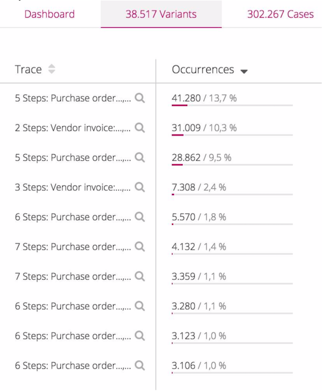

# Signapost Challenge

## The Goal
Please solve the challenge below by meeting the given acceptance criteria. Push your solution to this private GitHub repository and please do not publish your solution in any public GitHub repository or anywhere else! In general, feel free to make assumptions and have fun with the challenge!

## Details
A Signavio customer, a multinational company that builds industrial appliances, has an internal system dedicated to procuring (buying) any and all resources the company requires to operate. Procurement is done via the company's own ERP (Enterprise Resource Planning) system.

A typical business process represented the ERP system is "procure-to-pay", which generally involves the following activities:
* create purchase request
* request approved
* create purchase order
* select supplier
* receive goods
* pay invoice

Whenever the company wants to buy something, they do so through their ERP system.

The company buys many resources, always using their ERP system. Each resource purchase can be considered a case, or single instance of this process. As it happens, the actual as-is process often deviates from the ideal to-be process. Sometimes purchase requests are raised but never get approved, sometimes a supplier is selected but the goods are never received, sometimes it simply takes a long time to complete the process, and so on. We call these deviations from the process path variants.

The customer provides us with extracted process data from their existing ERP (Enterprise Resource Planning) system. The customer extracted one of their processes for analysis: Procure to Pay. The logfiles contain 3 columns:
* activity name
* case id
* timestamp

We want to analyse and compare process instances (cases) with each other. You can find the sample data set [here](samples/Activity_Log_2004_to_2014.csv).

## Acceptance Criteria
* Aggregate cases that have the same event execution order and list the 10 variants with the most cases.
* As the interaction is interactive, we need to be able to get the query results in well under 50 milliseconds.
* Provide your output as JSON, choose a structure that makes sense.

## Example

